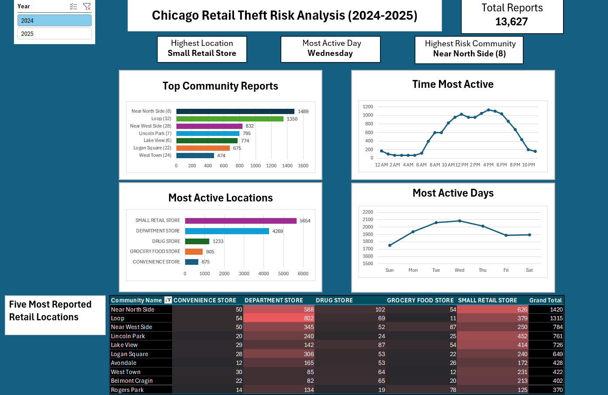

Chicago Crimes Dataset: https://azgeo-open-data-agic.hub.arcgis.com/datasets/COS-GIS::police-arrests/about

Chicago Retail Theft Risk Analysis (2024-2025)

Findings: 
Most of the Retail Thefts occur between Near North Side (8) and Loop (32).
Small Retail Stores are the number one target.
It's most active between 4:00 PM - 7:00 PM
The most active days are between Tuesday-Thursday
